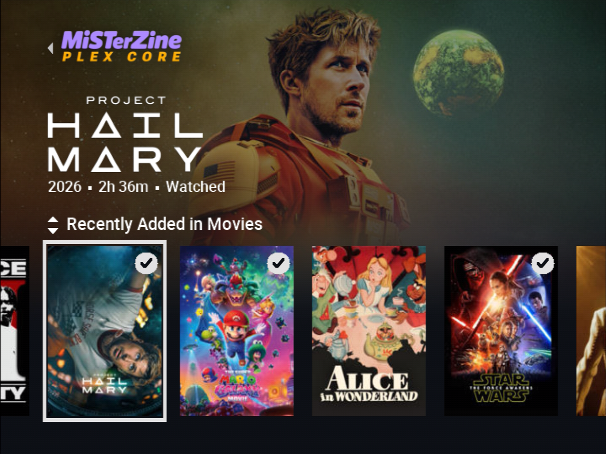

# MisterZine Plex Core

Watch your Plex library on MiSTer. Built for CRTs, with controller navigation
and HDMI support. The app's source is available in this repository.

## Install

Public releases are free and need no unlock code. The initial release and future
prereleases offer paid early access through Patreon: anyone can browse, but
playback requires the code from that version's Patreon post.

You'll need a networked MiSTer running current MiSTer Linux, at least 250 MB free
on the SD card, and a Plex account with access to a server that can transcode.

1. Download `MisterZine-Plex-Install.sh` from
   [Releases](https://github.com/matijaerceg/misterzine-plex-core/releases)
   and put it in the SD card's `Scripts` folder.
2. Run **Scripts > MisterZine-Plex-Install**.
3. Follow the sign-in screen at [plex.tv/link](https://plex.tv/link),
   choose your server, and pick something to watch.

For an early-access build, enter the Patreon code when you first press Play.
Next time, open **Scripts > MisterZine-Plex-Run**. Update All is optional.

CRT output is NTSC 480i; PAL isn't supported yet. With an RGB-only CRT profile,
select **Safe 480i** in the core's on-screen menu. HDMI supports 480p.

[Need help?](release/README.md) · [Build and contribute](CONTRIBUTING.md)

[Terms](release/TERMS.md) · [Component licenses](release/THIRD_PARTY_NOTICES.md).
Movie artwork belongs to its owners. Not affiliated with Plex or the MiSTer project.
