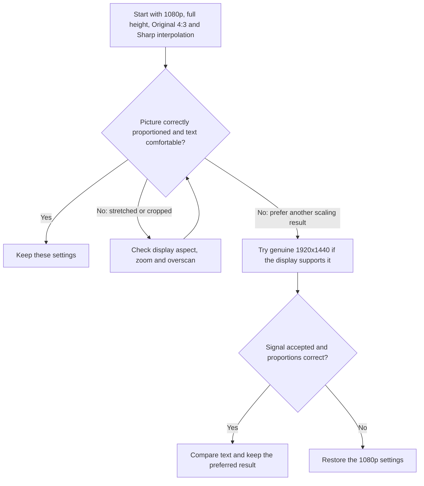

# HDMI setup

Start with **1080p, Original 4:3, full-height scaling and Sharp interpolation**.
This keeps the interface's proportions, fills the screen vertically and smooths
uneven text strokes. Side bars are normal on a widescreen display.

## Recommended starting point

1. For a direct HDMI connection to a modern display, select **Options > Video
   output > 480p (HDMI)** in Plex. This is the core's source signal; MiSTer's
   scaler produces the final HDMI resolution. Keep CRT safety restrictions in
   place if an analog CRT is also connected.
2. In the MiSTer OSD, select **HDMI aspect > Original 4:3**. Leave **Video output**
   on **App settings** for this HDMI setup.
3. Add or update this section in the **active MiSTer INI**, preserving other
   settings. If you use an alternate configuration, edit that file rather than
   assuming `MiSTer.ini` is active. Reload the core after saving.

   ```ini
   [MisterZine Plex Core]
   video_mode=8
   direct_video=0
   vscale_mode=0
   vscale_border=0
   ```

   This selects 1920x1080 at 60 Hz, scaled HDMI output and full-height scaling
   without an added border. These settings are scoped to Plex.
4. In **Video Processing**, set the horizontal filter to **From file** and choose
   **Interpolation (Sharp).txt**. Set the vertical filter to **From file** and
   choose the same file. Select an actual file; an empty selection is not this
   preset. No CRT simulation or scanline effect is needed.
5. On the display, preserve the incoming aspect ratio and disable zoom/overscan
   if the edges are cropped. The interface should reach the top and bottom,
   with side bars on a 16:9 screen.

## Choosing an alternative



- **Compatible higher-resolution displays:** `video_mode=12` selects genuine
  1920x1440 at approximately 60 Hz. It looked clear and correctly proportioned
  on the tested 4K monitor, including with NearNeighbour filtering. Keep
  full-height scaling and Original 4:3. Other displays may reject this timing
  or stretch it; have a way to restore the INI. This is not MiSTer's
  pixel-repeated 2560x1440 mode.
- **720p or 480p displays:** use a supported output mode (`video_mode=0` for
  1280x720, `6` for 640x480, or `2` for 720x480). Check proportions and text on
  the actual display. Lower-resolution trials remained usable, but were not
  preferred over the higher-resolution options. Filtering can trade sharpness
  for more even strokes; matching 720x480 alone does not guarantee one-to-one
  pixels after aspect correction.
- **Integer-height scaling** (`vscale_mode=1`) can make source rows more even,
  but leaves top/bottom bars at 1080p and an especially small picture at 720p.
  It is an optional preference, not the full-height recommendation.

## What has been checked

These recommendations come from DE10-Nano testing on a 4K monitor, with HDMI
capture used to verify 1080p and genuine 1920x1440 output. The monitor also
scales the incoming signal. Native 1080p and 720p panels still need separate
validation; this is a starting point rather than a guarantee for every display.
When comparing captures, view them at actual size so preview resizing does not
introduce another scaling artifact.

For more detail, see MiSTer's [video scaling documentation](https://mister-devel.github.io/MkDocs_MiSTer/advanced/videoscaling/)
and [output modes](https://mister-devel.github.io/MkDocs_MiSTer/advanced/videomodes/).
